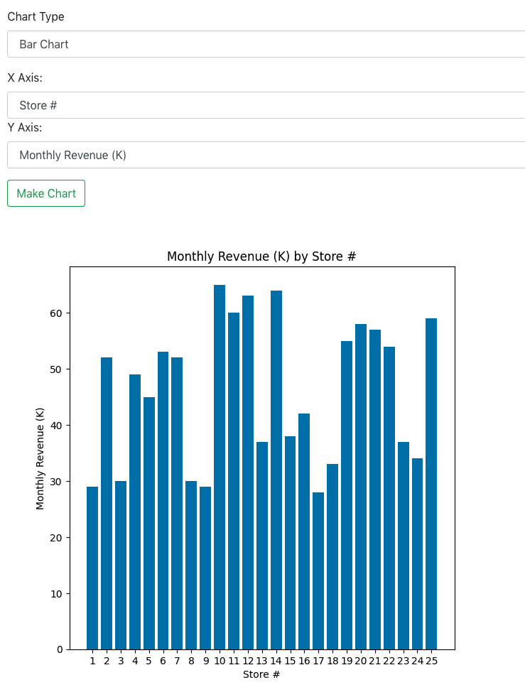

# Quick-Chart

## Description
Web-app that enables users to upload a CSV file and plot various charts.

Frontend: JavaScript, React 
Backend: Python, Django REST framework, Pandas, NumPy, Matplotlib

## Examples

